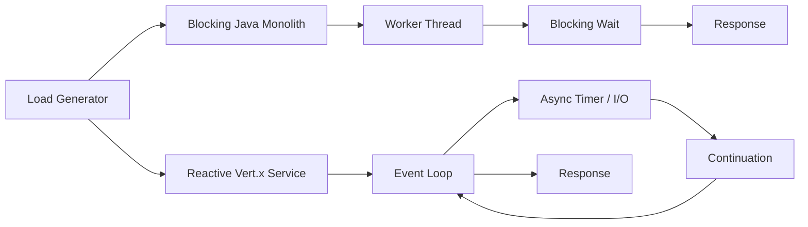

# Architecture Diagram

```mermaid
flowchart LR
    L[Load Generator] --> B[Blocking Java Monolith]
    L --> R[Reactive Vert.x Service]

    B --> BT[Worker Thread]
    BT --> BI[Blocking Wait]
    BI --> BR[Response]

    R --> EV[Event Loop]
    EV --> T[Async Timer / I/O]
    T --> RR[Continuation]
    RR --> EV
    EV --> RSP[Response]
```

The diagram isolates the execution-model difference used by the reference implementation.
